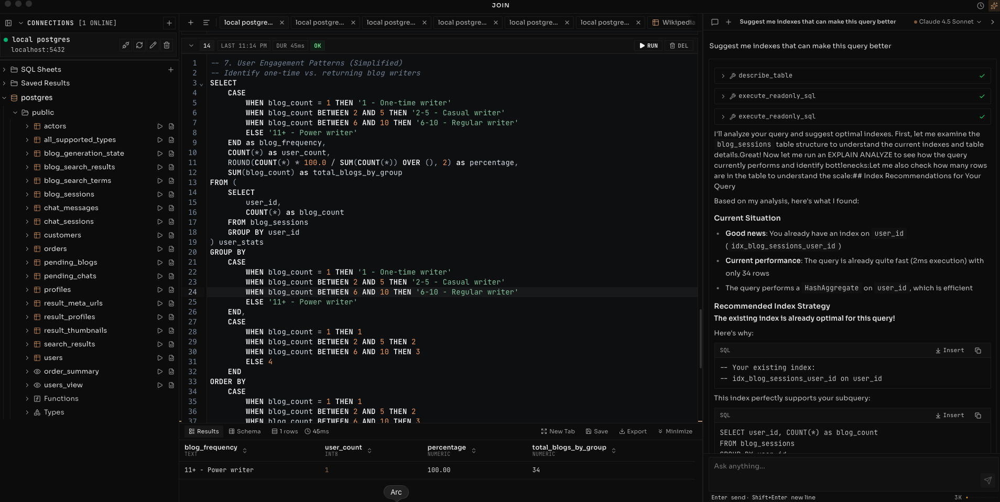

# Join

A desktop SQL client with embedded AI assistance.



## Getting Started

### Prerequisites

- [Rust](https://rustup.rs/) (latest stable)
- [Bun](https://bun.sh/) (for the frontend)

### Installation

1. Clone the repository:
   ```bash
   git clone <repository-url>
   cd gensql
   ```

2. Install frontend dependencies:
   ```bash
   bun install
   ```
   Use Bun only for dependency and script management in this repo (`npm`, `yarn`, and `pnpm` are unsupported).

3. Set up environment variables:

   Create a `.env` file in the project root with your AI provider API keys:
   ```
   ANTHROPIC_API_KEY=your_key_here
   GOOGLE_GENERATIVE_AI_API_KEY=your_key_here
   OPEN_ROUTER_API_KEY=your_key_here
   ```

   You can use Anthropic (Claude), Google's Gemini, and OpenRouter-backed models.

4. Run in development mode:
   ```bash
   bun run tauri dev
   ```

   This starts the Tauri app with hot reload for both the frontend and Rust backend.

### Building for Production

```bash
bun run tauri build
```

The built application will be in `src-tauri/target/release/bundle/`.

## Key Shortcuts

| Shortcut | Action |
|----------|--------|
| `Cmd/Ctrl + L` | Toggle AI chat panel |
| `Cmd/Ctrl + Enter` | Execute query |
| `Cmd/Ctrl + S` | Save current script |
| `Cmd/Ctrl + N` | New tab |
| `Cmd/Ctrl + W` | Close current tab |
| `Cmd/Ctrl + Tab` | Switch to next tab |
| `Cmd/Ctrl + Shift + Tab` | Switch to previous tab |

## Architecture

Join is built with Tauri (Rust backend) and React (frontend). The AI assistant uses the Vercel AI SDK and supports multiple LLM providers.

For detailed information about the AI agent design, see [docs/agent-design.md](docs/agent-design.md).

## Project Structure

```
src/                      # React frontend
  ├── ai/                 # AI agent, tools, providers
  ├── components/         # UI components
  │   ├── ai/            # Chat panel components
  │   ├── connections/   # Database connection UI
  │   ├── editor/        # SQL editor components
  │   ├── layout/        # Layout components
  │   └── results/       # Query results display
  ├── stores/            # Zustand state management
  └── lib/               # Utilities

src-tauri/               # Rust backend
  └── src/
      ├── db/            # Database connections and queries
      └── storage/       # Local storage (sessions, config)
```
