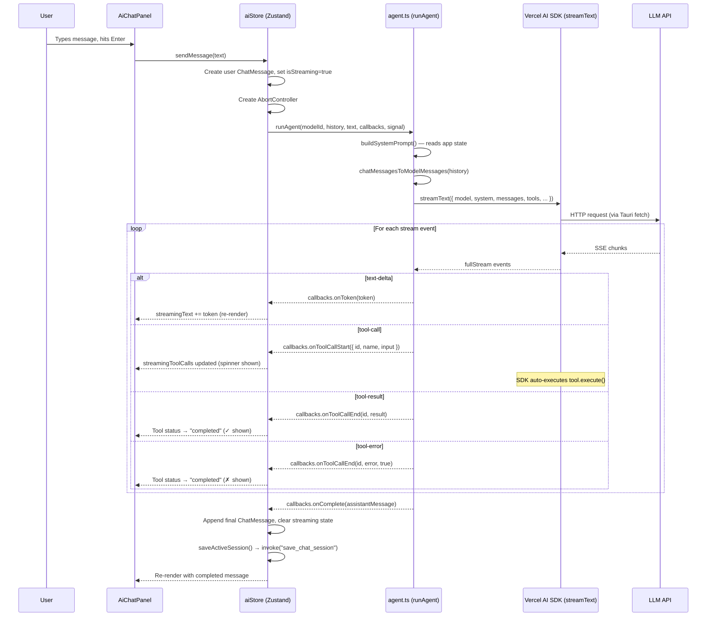
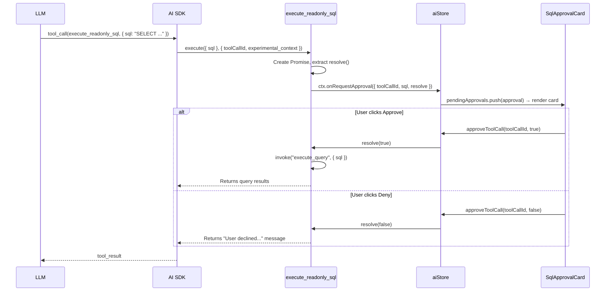

# AI Agent — Design & Architecture

An AI assistant embedded inside Join (a Tauri desktop SQL client) that can explore schemas, run read-only queries, and manipulate the SQL editor — all through a chat panel.

---

## High-Level Architecture

```
┌────────────────────────────────────────────────────────────────────┐
│                         Tauri Desktop App                         │
│  ┌──────────────────────────────────────────────────────────────┐  │
│  │  React Frontend (Vite)                                      │  │
│  │                                                             │  │
│  │  ┌─────────────┐   ┌──────────────┐   ┌──────────────────┐  │  │
│  │  │ AiChatPanel │──▶│  aiStore.ts  │──▶│    agent.ts      │  │  │
│  │  │ (UI)        │◀──│  (Zustand)   │◀──│ (Vercel AI SDK)  │  │  │
│  │  └─────────────┘   └──────────────┘   └───────┬──────────┘  │  │
│  │                                               │             │  │
│  │                          ┌─────────────────────┤             │  │
│  │                          ▼                     ▼             │  │
│  │                   ┌────────────┐       ┌─────────────┐      │  │
│  │                   │  Tools     │       │ providers.ts │      │  │
│  │                   │ (11 tools) │       │ (AI models)  │      │  │
│  │                   └─────┬──────┘       └──────┬──────┘      │  │
│  └─────────────────────────┼─────────────────────┼──────────┘  │  │
│                            │                     │              │
│                            ▼                     ▼              │
│            ┌───────────────────────┐   ┌─────────────────┐      │
│            │ Tauri Backend (Rust)  │   │  LLM APIs       │      │
│            │ • DB queries          │   │  (Anthropic,    │      │
│            │ • Schema introspection│   │   Google)        │      │
│            │ • Session persistence │   └─────────────────┘      │
│            │ • Env var access      │                            │
│            └───────────────────────┘                            │
└────────────────────────────────────────────────────────────────────┘
```

---

## File Map

| File | Role |
|------|------|
| `src/ai/agent.ts` | Core agent loop — calls `streamText()`, processes stream events |
| `src/ai/types.ts` | Type definitions (`ChatMessage`, `ToolCallDisplay`, `PendingApproval`) + message format conversion |
| `src/ai/providers.ts` | Creates Vercel AI SDK provider instances (Anthropic, Gemini) with Tauri HTTP fetch |
| `src/ai/context.ts` | Builds the system prompt dynamically from app state |
| `src/ai/tools/index.ts` | Aggregates and exports all 11 tools |
| `src/ai/tools/schemaTools.ts` | `list_schemas`, `list_tables`, `describe_table`, `list_views`, `describe_view`, `list_functions` |
| `src/ai/tools/queryTools.ts` | `execute_readonly_sql` (with approval flow), `get_query_history` |
| `src/ai/tools/editorTools.ts` | `get_editor_context`, `insert_sql`, `replace_editor_content` |
| `src/stores/aiStore.ts` | Zustand store — state management, orchestrates the entire send → stream → callback flow |
| `src/components/ai/AiChatPanel.tsx` | Main chat panel UI (header, session list, message list, input) |
| `src/components/ai/ChatMessage.tsx` | Message rendering: markdown, code blocks, tool call cards, SQL approval cards |
| `src/components/layout/MainLayout.tsx` | Hosts the AI panel as a resizable right-side panel |

---

## Message Flow (User sends a message)



---

## System Prompt Construction (`context.ts`)

`buildSystemPrompt()` reads live app state via `useAppStore.getState()` and assembles:

1. **Role** — "You are a SQL expert assistant for Join..."
2. **Connection info** — name, type (Postgres/MySQL/etc.), host, database, status
3. **Schema summary** — lists table/view/function/type *names only* (the agent uses `describe_table` for column details)
4. **Editor state** — selected text, full editor content, cursor position, active script name
5. **Instructions** — guidelines on tool usage, SQL dialect, and response formatting

The prompt is rebuilt from scratch on every `sendMessage` call, so it always reflects the current state.

---

## Agent Loop (`agent.ts`)

```typescript
const result = streamText({
  model,                    // Vercel AI SDK model instance
  system: systemPrompt,     // Dynamic prompt from context.ts
  messages: [...history, { role: "user", content: userText }],
  tools: allTools,          // 11 tools with schemas + execute()
  maxOutputTokens,          // From model config
  stopWhen: stepCountIs(15), // Max 15 tool-use iterations
  abortSignal: signal,      // From AbortController
  experimental_context: agentContext, // Passed to tool execute()
});
```

The `result.fullStream` async iterator yields event objects:

| Event type | What happens |
|-----------|--------------|
| `text-delta` | Accumulate text, fire `onToken` |
| `tool-call` | Log tool call, fire `onToolCallStart` — SDK then auto-executes the tool's `execute()` function |
| `tool-result` | Mark tool complete, fire `onToolCallEnd` |
| `tool-error` | Mark tool errored, fire `onToolCallEnd` with `isError=true` |
| `error` | Throw and let the store's error handler catch it |

The SDK handles the **agentic loop** automatically: after a tool result, it sends the result back to the LLM, which may respond with more text or more tool calls, up to `stopWhen: stepCountIs(15)`.

---

## Tool Definitions

Each tool is defined with the Vercel AI SDK `tool()` helper:

```typescript
export const describeTable = tool({
  description: "Get detailed info about a table...",
  inputSchema: z.object({
    schema: z.string(),
    table: z.string(),
  }),
  execute: async ({ schema, table }) => {
    // Call Tauri backend via invoke()
    const columns = await invoke("get_columns", { connectionId, table, schema });
    return JSON.stringify({ columns, indexes }, null, 2);
  },
});
```

### Tool Categories

**Schema exploration** — all call `invoke()` to hit the Rust backend:
- `list_schemas`, `list_tables`, `describe_table`, `list_views`, `describe_view`, `list_functions`

**Query execution** — `execute_readonly_sql` uses an approval flow:
```
execute() called → Promise created → onRequestApproval(resolve) →
  UI shows SqlApprovalCard → user clicks Approve/Deny →
  resolve(true/false) → tool continues or returns denial message
```

**Editor manipulation** — reads/writes to CodeMirror:
- `get_editor_context`, `insert_sql`, `replace_editor_content`

---

## Providers (`providers.ts`)

```
MODEL_CONFIGS[] → defines available models with { id, name, providerId, maxOutputTokens, envVar }
```

Currently supports:
- **Anthropic**: Claude 4.5 Sonnet, Claude 4.5 Opus, Claude 4.6 Opus
- **Google**: Gemini 2.5 Pro

Key detail: HTTP requests go through **Tauri's fetch** (`@tauri-apps/plugin-http`), not the browser's `fetch`, to avoid CORS issues in the desktop app. API keys are fetched from the Rust backend via `invoke("get_env_var")`. Provider instances are cached by `providerId:apiKey`.

---

## State Management (`aiStore.ts`)

Zustand store with the following shape:

```
{
  isPanelOpen,          // Panel visibility toggle
  selectedModelId,      // Current model ID
  sessions[],           // Session metadata list
  activeSessionId,      // Current session
  activeSession,        // Full session with messages[]

  isStreaming,           // Is the agent currently running?
  streamingText,        // Accumulated text during streaming
  streamingToolCalls[], // Live tool call statuses
  abortController,      // For aborting the stream
  pendingApprovals[],   // Awaiting user approve/deny
}
```

### `sendMessage(text)` flow:
1. Create `ChatMessage { role: "user" }`, append to session
2. Auto-title session from first message: `text.slice(0, 50)`
3. Create `AbortController`
4. Call `runAgent()` with 6 callbacks:
   - `onToken` → appends to `streamingText`
   - `onToolCallStart` → pushes to `streamingToolCalls` with `status: "running"`
   - `onToolCallEnd` → updates tool call to `status: "completed"`
   - `onRequestApproval` → pushes to `pendingApprovals`
   - `onComplete` → builds final `ChatMessage`, clears streaming state, saves session
   - `onError` → creates error `ChatMessage`, clears streaming state

### `stopStreaming()`
Rejects all pending approvals (`resolve(false)`), calls `abortController.abort()`, resets streaming state.

### `approveToolCall(toolCallId, approved)`
Finds the `PendingApproval` by ID, calls its `resolve(approved)` to unblock the tool's `execute()`.

### Persistence
Sessions are saved to the Tauri backend via `invoke("save_chat_session")` / `invoke("list_chat_sessions")` / `invoke("get_chat_session")` / `invoke("delete_chat_session")`.

---

## How `ChatMessage[]` becomes `ModelMessage[]`

The `chatMessagesToModelMessages()` function in `types.ts` converts the UI-friendly `ChatMessage[]` into the AI SDK's wire format:

```
User message → { role: "user", content: "..." }

Assistant message (text only) → { role: "assistant", content: "..." }

Assistant message (with tool calls) →
  1. { role: "assistant", content: [{ type: "text", text }, { type: "tool-call", toolCallId, toolName, input }, ...] }
  2. { role: "tool", content: [{ type: "tool-result", toolCallId, toolName, output }, ...] }
```

Error messages (`isError: true`) are skipped during conversion.

---

## UI Structure

### Layout (`MainLayout.tsx`)

```
┌──────────────────────────────────────────────────┐
│ TitleBar                                         │
├────────┬──────────────────────┬───────────────────┤
│        │  EditorToolbar       │                   │
│ Side-  │  SqlEditor           │  AiChatPanel      │
│ bar    │──────────────────────│  (when open)      │
│ (18%)  │  ResultsPanel        │  (25%)            │
│        │  (57% when AI open)  │                   │
└────────┴──────────────────────┴───────────────────┘
```

The AI panel is a `<Panel>` inside `react-resizable-panels`. It renders conditionally when `isPanelOpen` is `true`. The main content area shrinks from 82% → 57% when the panel opens.

### `AiChatPanel.tsx` Components

```
AiChatPanel
├── Header
│   ├── Session history button (toggles SessionList overlay)
│   ├── New chat button
│   └── ModelSelector (dropdown with provider groups)
├── SessionList (overlay — lists past chats)
├── Messages area (scrollable)
│   ├── ChatMessageComponent × N (completed messages)
│   └── ChatMessageComponent (streaming — synthetic message)
└── Input area
    ├── Auto-resizing textarea
    ├── Send button / Stop button (toggles based on isStreaming)
    └── Keyboard shortcut hint (Enter / Shift+Enter)
```

### `ChatMessage.tsx` Components

```
ChatMessageComponent
├── User message → plain white text in darker bg
├── Error message → red card with AlertCircle icon
└── Assistant message
    ├── ToolCallItem[] → expandable cards with name, spinner/✓/✗, input/result JSON
    ├── SqlApprovalCard[] → amber card with SQL preview + Approve/Deny buttons
    ├── MarkdownContent → react-markdown with custom components
    │   └── CodeBlock → syntax-highlighted block with Copy + Insert (for SQL) buttons
    ├── "Thinking..." spinner (when streaming, no content yet)
    └── Blinking cursor (when streaming with content)
```

### Streaming UI Behavior

During streaming, the store maintains `streamingText` and `streamingToolCalls[]` separately. A **synthetic** `ChatMessage` with `id: "streaming"` is rendered, passing these as props:

```tsx
<ChatMessageComponent
  message={{ id: "streaming", role: "assistant", content: "", timestamp: Date.now() }}
  isStreaming={true}
  streamingText={streamingText}
  streamingToolCalls={streamingToolCalls}
  pendingApprovals={pendingApprovals}
/>
```

When the agent completes, `onComplete` fires: the streaming message disappears and a real `ChatMessage` (with accumulated text + final tool calls) is appended to the session.

---

## SQL Approval Flow (detailed)



The trick: `execute()` creates a `new Promise<boolean>` and passes its `resolve` function out through `onRequestApproval`. The tool is literally **blocked** at `await` until the user clicks a button in the UI. The SDK waits for the tool to finish before sending results to the LLM.

---

## Abort / Stop Flow

1. User clicks Stop button → `stopStreaming()`
2. All `pendingApprovals` are resolved with `false`
3. `abortController.abort()` fires
4. The stream loop in `agent.ts` checks `signal?.aborted`, throws `"Aborted"`
5. The catch block in `aiStore.sendMessage` detects the abort, clears state without adding an error message

---

## Session Persistence

Sessions are stored via the **Tauri Rust backend** (not localStorage):

| Tauri command | Purpose |
|--|--|
| `list_chat_sessions` | Returns `ChatSessionMeta[]` (no messages) |
| `get_chat_session` | Returns full `ChatSession` with messages |
| `save_chat_session` | Persists a session (create or update) |
| `delete_chat_session` | Removes a session |

The store calls `saveActiveSession()` after every completed or errored agent run.
